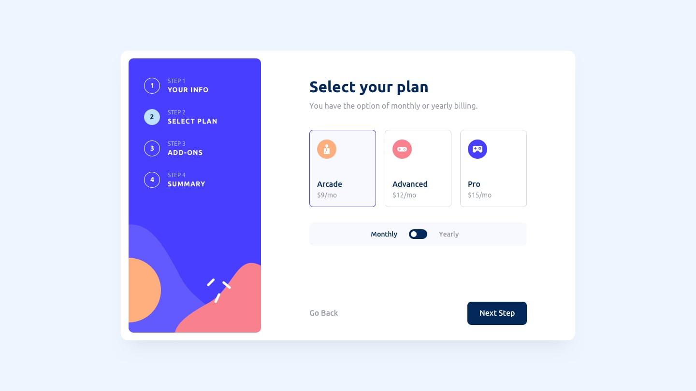

This is a solution to the Multi-step form challenge on Frontend Mentor. Frontend Mentor challenges help you improve your coding skills by building realistic projects.

- [URL for my solution is here](https://aflo7.github.io/multi-step-form/)

### Built with
- CSS
- HTML
- JavaScript
- CSS Flex
- Responsive Web Design
- [Vue](https://vuejs.org/)

[Frontend Mentor](https://www.frontendmentor.io) challenges help you improve your coding skills by building realistic projects.

**To do this challenge, you need a good understanding of HTML, CSS and JavaScript.**

## The challenge

Your challenge is to build out this multi-step form and get it looking as close to the design as possible.

